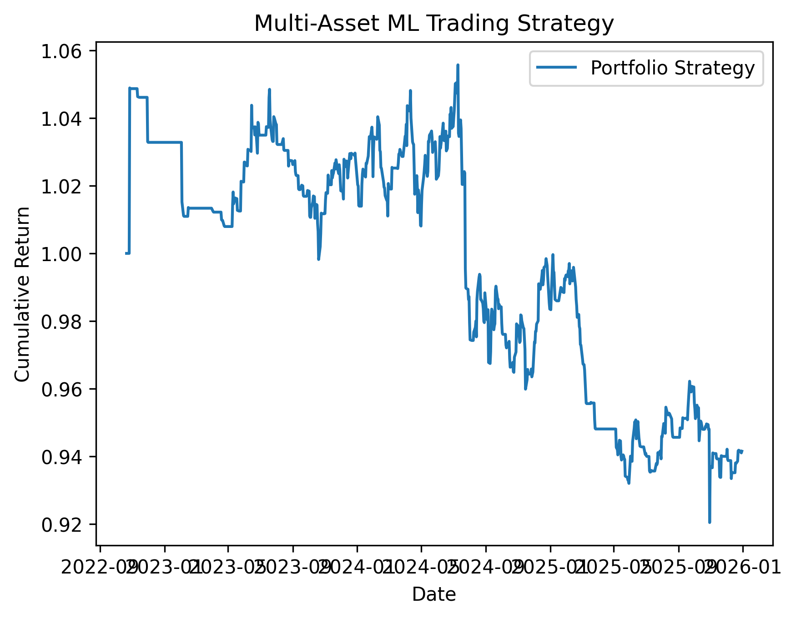

# 📈 Quantitative ML Trading Strategy

A machine learning-based trading strategy designed to predict short-term price movements using financial time-series data.

The project focuses on building a realistic end-to-end pipeline, including feature engineering, model training, walk-forward validation, and multi-asset portfolio backtesting.

---

## 🚀 Overview

This project simulates a systematic trading strategy by:

- Extracting features from historical market data  
- Training a machine learning model (XGBoost)  
- Generating trading signals based on prediction confidence  
- Applying a trend filter to reduce noise  
- Backtesting the strategy using realistic assumptions  
- Extending the approach to a multi-asset portfolio  

---

## 🧠 Key Components

### 📊 Feature Engineering
- Momentum
- Volatility
- Moving averages (MA10, MA50, MA200)
- RSI (Relative Strength Index)
- Returns

---

### 🤖 Machine Learning Model
- XGBoost classifier for price direction prediction  
- Predicts probability of next-day positive return  

---

### 🔁 Walk-Forward Validation
- Rolling training window (time-aware split)  
- Prevents data leakage  
- Simulates real-world trading conditions  

---

### ⚙️ Strategy Logic
- Long positions when:
  - Model confidence is high  
  - Market is in an uptrend  

- Short positions when:
  - Model confidence is low  
  - Market is in a downtrend  

- Position sizing based on prediction confidence  

---

### 📉 Backtesting
- Daily returns simulation  
- Transaction costs included  
- Performance metrics:
  - Cumulative return  
  - Sharpe ratio  

---

### 💼 Multi-Asset Portfolio
- Strategy applied across multiple assets (e.g., AAPL, MSFT, GOOGL, AMZN, META)  
- Equal-weight portfolio construction  
- Aggregated performance evaluation  

---

## 📊 Example Output

- Strategy vs Market performance plot  
- Portfolio cumulative return  
- Sharpe ratio  

---
## 📊 Strategy Performance



## 🧠 Key Learnings

- Building a profitable trading strategy is significantly harder than training a model  
- Avoiding overfitting is critical in financial applications  
- Signal generation is the main challenge in quantitative trading  
- Walk-forward validation is essential for realistic evaluation  

---

## ⚠️ Disclaimer

This project is for educational purposes only and does not constitute financial advice.

---

## 📂 Project Structure

├── data_loader.py   # Core logic (features, model, strategy, backtest)
├── main.py          # Entry point
├── README.md
├── requirements.txt

---

## ▶️ How to Run

```bash
pip install -r requirements.txt
python main.py

👨‍💻 Author

Yaniv Shaino
LinkedIn

